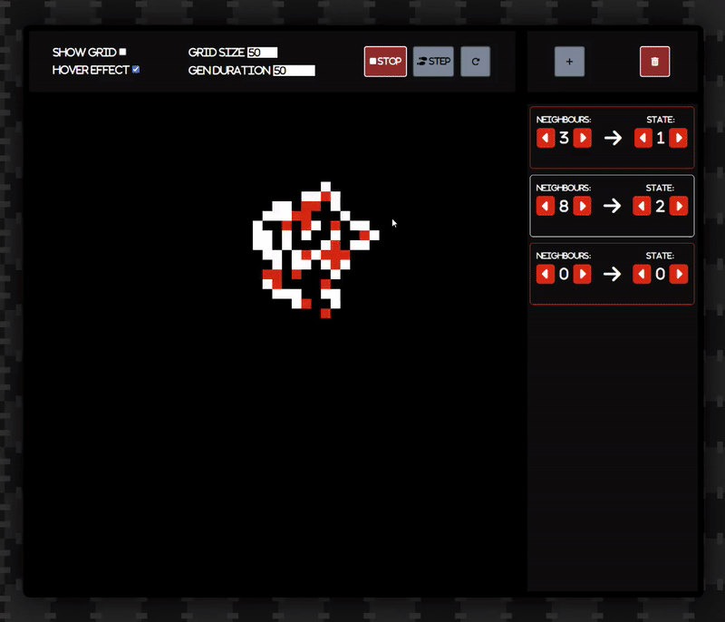
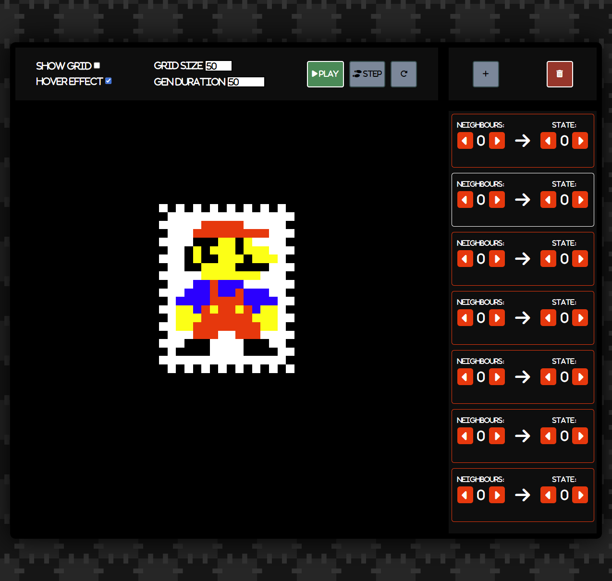

# Celluar-Automata-Maker

### A way to quickly make and test out your own Cellular Automata!

>simply add states and rules based on the number of neighbours

- ### game of life example:

- ### possibility for complex multi-state systems:

- ### up to 7 different possible states!

